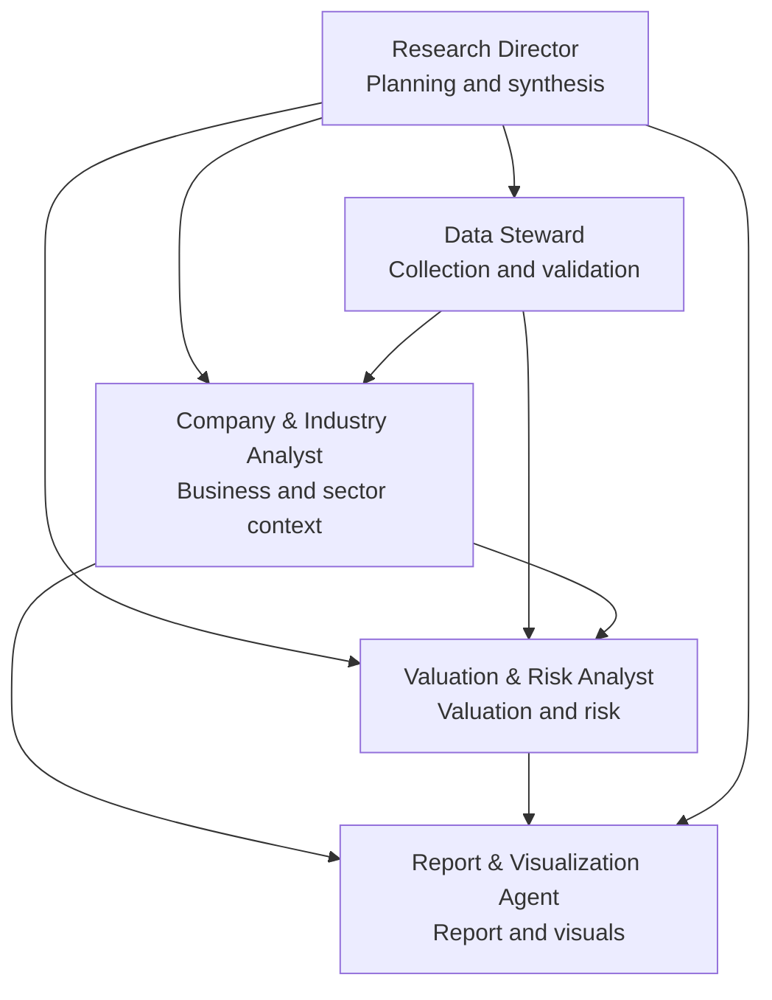

# Agent Organization

## Design Principle

Start with fewer agents than feels impressive. Add agents only when a role has a distinct responsibility, failure mode, or quality-control need.

Version 1 uses five core agents.

## Organization Chart

## Agent 1: Research Director

### Mission

Turn a user request into a focused research plan and final judgment.

### Responsibilities

- Interpret the user intent.
- Select research depth.
- Select the most appropriate output form for the task.
- Define investment horizon and risk lens.
- Assign work to other agents.
- Decide what evidence is required for the selected depth.
- Decide when data collection is "enough for now."
- Resolve conflicts between findings.
- Ensure the final report is concise, useful, and honest.

### Must Not

- Invent data.
- Hide uncertainty.
- Let the final report become longer than the question deserves.

## Agent 2: Data Steward

### Mission

Collect, structure, and check the data used by the research system.

The Data Steward is allowed to decide what data to look for, but only within the research plan set by the Research Director.

It should seek decision-grade data, not every possible data point.

### Responsibilities

- Gather price, volume, financial, company, industry, and news data.
- Track source, date, unit, currency, and reporting period.
- Flag missing, stale, conflicting, or suspicious data.
- Separate verified data from inferred data.
- Recommend whether the available data is enough for the selected report depth.
- Create focused data requests when analysts need more evidence.

### Data Collection Standard

Collect until one of these is true:

- the selected report depth can be supported,
- the missing data is unlikely to change the conclusion,
- the missing data is important but unavailable and must be disclosed,
- the Research Director decides the extra search cost is not worth it.

### Must Not

- Make investment recommendations.
- Smooth over data conflicts silently.
- Keep searching after the marginal value is low.
- Expand the research scope without approval from the Research Director.

## Agent 3: Company & Industry Analyst

### Mission

Explain how the company actually makes money, what industry forces shape it, and what could change.

### Responsibilities

- Analyze business model, revenue drivers, margins, cash flow, balance sheet, and management commentary.
- Compare the company against peers.
- Explain industry structure, cyclicality, demand drivers, regulation, and competitive position.
- Identify growth drivers, competitive advantages, and business risks.
- Summarize the company in plain language.
- Request additional data only when it would materially change the business thesis.

### Must Not

- Treat narrative as proof.
- Ignore weakening fundamentals because the market price is rising.
- Turn industry research into a separate long report unless the stock thesis requires it.

## Agent 4: Valuation & Risk Analyst

### Mission

Translate business quality and expectations into valuation ranges and risk conditions.

### Responsibilities

- Use appropriate valuation methods.
- Compare against peers and history.
- Build simple base, bull, and bear cases.
- Identify key assumptions and what would break them.
- Challenge optimistic conclusions.
- Request additional data only when it would materially change valuation or risk.

### Must Not

- Present a precise fair value when the evidence only supports a range.
- Use valuation multiples without explaining why they are relevant.

## Agent 5: Report & Visualization Agent

### Mission

Produce the final artifact: report, chart, memo, dashboard, or project map update.

### Responsibilities

- Convert analysis into a clear report.
- Create visual summaries when they increase understanding.
- Maintain project diagrams and living documentation.
- Keep the report aligned with selected depth.

### Must Not

- Add decorative complexity.
- Turn uncertainty into confident prose.

## Expansion Candidates

Add these only when the MVP shows real need:

- Market Technical Analyst
- Macro & Sector Analyst
- Portfolio Constructor
- Backtesting Agent
- Monitoring Agent
- Compliance & Disclosure Agent
