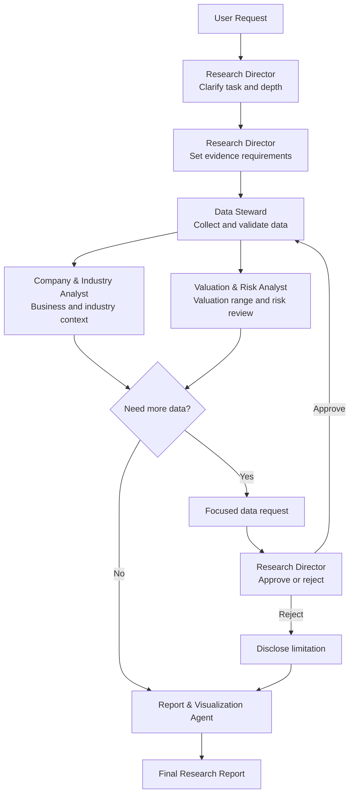

# Research Workflow

## Default Flow

## Step 1: Interpret Request

Identify:

- ticker, company, industry, or portfolio universe,
- requested depth,
- investment horizon,
- risk preference,
- output format.

If missing, use defaults:

- depth: standard,
- horizon: 6-12 months,
- risk preference: medium,
- output format: research memo.

The Research Director may change the output form when another format better serves the decision, but should keep Markdown as the default MVP format.

## Step 2: Build Research Plan

The Research Director decides which modules are needed:

- company overview,
- industry context,
- financial trends,
- valuation,
- catalysts,
- risks,
- peer comparison,
- scenario analysis,
- portfolio fit.

The Research Director also sets evidence requirements:

- must-have data,
- nice-to-have data,
- acceptable missing data,
- stopping conditions.

## Step 3: Gather Data

The Data Steward decides what data to seek within the research plan.

It collects and records:

- source,
- retrieval date,
- reporting period,
- currency,
- units,
- whether data is verified or inferred.

The Data Steward should not try to find everything. It should find the smallest reliable data package that can support the chosen report depth.

## Step 4: Validate Data

Before analysis, check:

- stale data,
- conflicting sources,
- missing values,
- unit mismatch,
- stock split or ticker changes,
- fiscal year differences,
- GAAP vs non-GAAP metrics.

After validation, the Data Steward gives one of three statuses:

- enough for selected depth,
- enough with disclosed limitations,
- not enough; focused data request needed.

## Step 5: Analyze Business

The Company & Industry Analyst answers:

- What does the company do?
- How does it make money?
- What industry does it compete in?
- What industry forces matter for the stock thesis?
- What drives growth?
- What are margin and cash-flow trends?
- What does the market currently believe?
- What could change the story?

Industry analysis should be proportional. It is a required context layer, not a separate report by default.

If the business thesis depends on missing data, the Company & Industry Analyst creates a focused data request instead of guessing.

## Step 6: Analyze Valuation And Risk

The Valuation & Risk Analyst answers:

- What valuation methods are relevant?
- What range is reasonable?
- What assumptions matter most?
- What is the bear case?
- What would make the thesis wrong?

If valuation or risk depends on missing data, the Valuation & Risk Analyst creates a focused data request instead of filling the gap with confidence.

## Step 6.5: Data Request Loop

Analysts may request more data, but they must explain:

- what data is needed,
- why it matters,
- how it could change the conclusion,
- whether the report can proceed without it.

The Research Director decides whether to:

- approve more data collection,
- proceed with disclosed limitations,
- lower report depth,
- or stop the task.

## Step 7: Compress Into Report

The Report & Visualization Agent writes only what the chosen depth requires.

The report should include:

- conclusion first,
- evidence second,
- risks third,
- appendix only if needed.

## Step 8: Final Quality Pass

Before delivery, check:

- Are claims sourced or labeled as assumptions?
- Are risks strong enough?
- Is the conclusion too confident?
- Is the report longer than necessary?
- Is the selected depth respected?

