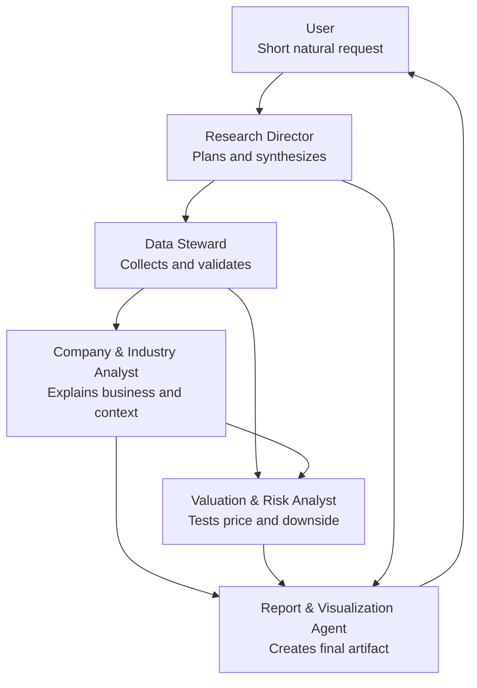

# Live Project Map

This is the always-current map of the AI equity research system.

Update this file whenever the project structure, agent roles, or build priorities change.

## Current System Shape



## Current Build Stage

Phase 3: Single-Stock MVP

Status: active

## Active Principle

Less is more, but only after truth survives compression.

## Current Agent Count

Five core agents:

- Research Director
- Data Steward
- Company & Industry Analyst
- Valuation & Risk Analyst
- Report & Visualization Agent

Primary protocol:

- `08_RESEARCH_MANAGER_PROTOCOL.md`
- `10_INVESTMENT_JUDGMENT_FRAMEWORK.md`
- `11_RATING_MODEL.md`
- `12_WEB_RESEARCH_PROTOCOL.md`
- `09_MVP_RUNBOOK.md`
- `skills/financial-long-document-reader/SKILL.md`

## Current MVP Target

Single-stock, rating-backed research memo from an annual report, official source file, and optional financial-data Excel.

Default user prompt:

```text
Analyze [ticker], standard depth, 6-12 month horizon, medium risk.
```

Initial defaults:

- market: US equities,
- output: Markdown,
- language: English-only for MVP,
- industry analysis: included as thesis context, not a separate report by default.
- data path: prefer authoritative uploaded/exported files before web scraping.
- first reliable input: annual reports.

Runnable MVP path:

```text
inputs/[company-source-package] -> source notes + research memo + summary.json
```

Current code:

- `src/mvp_research_memo.py`
- `scripts/run_mvp.ps1`
- `13_INPUT_OUTPUT_CONTRACT.md`

Current judgment gates:

- autonomous research planner: decides the next missing evidence task,
- source sufficiency gate: decides whether a directional rating is allowed,
- root driver gate: separates observed facts from group-level economic drivers that can move EPS, FCF, fair value, or justified multiple,
- materiality gate: checks whether a driver is large, profitable, sustainable, company-specific, observable, and valuation-relevant,
- market expectation gap engine: separates business quality from stock mispricing,
- multiple-based valuation bridge: builds Standard pre-DCF bear/base/bull cases from driver assumptions, financial anchors, and justified multiple ranges,
- DCF readiness gate: asks for modeling only after valuation inputs are clean and the opportunity may matter.
- evidence acquisition loop: converts the highest-priority evidence gap into a targeted offline search log in `web-mode auto`.
- evidence intake: accepts labeled `evidence_patch.json` values and reruns valuation reconciliation.
- quality evaluation harness: writes deterministic `quality-score.json` after each memo.
- sell-side independence: institutional reports are optional; annual reports, financial data, market data, and source patches can produce a directional memo.

Current project skills:

- `skills/equity-research-agent/SKILL.md`
- `skills/financial-long-document-reader/SKILL.md`

Current web layer:

- `12_WEB_RESEARCH_PROTOCOL.md`
- `skills/web-research-brief/SKILL.md`
- MVP accepts compact Markdown/JSON web research briefs as `web_research` sources.
- Web evidence can update market data, recent events, valuation bridge, and thesis probability; it does not override official filings.
- Web search logs are audit/debug artifacts only. The research memo should consume compact reviewed web briefs, not query plans.

## Planned Language Modes

Current MVP:

- English only.

Later phases should support:

- Chinese,
- bilingual Chinese-English.

Current status: planned, not implemented as a separate agent.

Likely future owner: Report & Visualization Agent first; Language & Localization Agent only if needed later.

## Efficiency Rule

Less is more also means making the most efficient decision:

- reuse validated industry context,
- update only changed facts,
- keep compact sourced summaries,
- avoid storing raw clutter,
- stop when extra analysis is unlikely to change the conclusion.

## Thesis Rule

The current MVP is not a source summarizer. It must turn evidence into a predictive stock thesis:

```text
source fact -> observed fact -> surface driver -> root economic driver -> financial line item -> market expectation gap -> valuation / rating impact -> invalidation trigger
```

Only facts that affect cash flow, growth durability, margin quality, risk, or valuation enter the final memo.

When valuation or forecast data is available, the memo must give a Buy/Overweight, Neutral, Sell/Underweight, or No Rating conclusion before the thesis detail.

The final thesis should be condition-based, not angle-based: state one core thesis, then list the conditions required for it to be true, their probability, the evidence, and the triggers that change the rating.

Rating Model v0.2:

```text
Rating = probability-weighted thesis upside - downside risk
```

## Data Decision Rule

Data Steward can autonomously look for data within the Research Director's plan.

It should stop when the report has enough evidence for the selected depth, or when missing data should simply be disclosed.

If Company & Industry Analyst or Valuation & Risk Analyst needs more evidence, they create a focused data request. Research Director decides whether the request is worth the extra search.

## Long Document Rule

For annual reports, filings, analyst PDFs, and long industry reports, the first output is a source map:

```text
file -> source type -> period/date -> useful pages/sections -> extraction quality
```

The system should not read long documents linearly by default. It should map first, then target the pages and tables that can change rating, thesis conditions, valuation bridge, downside risk, or confidence.

## Current Open Questions

- Which authoritative input format should be supported after annual report PDF: Bloomberg export, Wind export, IR PDF, or CSV/XLSX?
- How should the MVP express rating language without becoming personalized financial advice?
- When should industry analysis become its own agent?

## Update Rule

When the system changes, update this file first, then update the detailed file:

- agent change: `01_AGENT_ORG.md`
- Research Manager change: `08_RESEARCH_MANAGER_PROTOCOL.md`
- MVP runbook change: `09_MVP_RUNBOOK.md`
- principle change: `02_CORE_PRINCIPLES.md`
- process change: `03_RESEARCH_WORKFLOW.md`
- output change: `04_REPORT_DEPTH_LEVELS.md`
- data change: `05_DATA_POLICY.md`
- web research change: `12_WEB_RESEARCH_PROTOCOL.md`
- timeline change: `06_ROADMAP.md`
